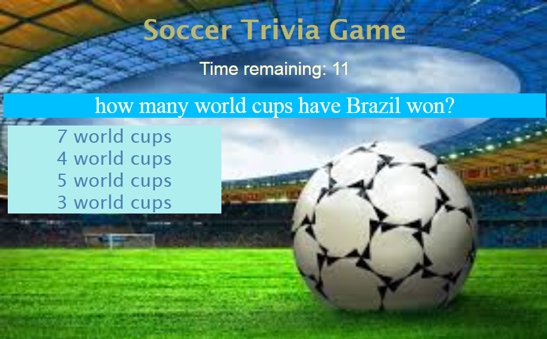

# trivia-game

This assignment is a Trivia game Javascript for the logic and jQuery to manipulate HTML. The layout of this app has a HTML page and stylish CSS.
The trivia will be in form of multiple choice or true/false options. The user will have a limited amount of time to answer each question.

- To view this Page:https://mguaraz120.github.io/trivia-game/
- My Portfolio:https://mguaraz120.github.io/Portfolio/
- My Linkedin Page:https://www.linkedin.com/in/mario-vizcaino-187ab9104/

## Technologies Used

- Jquery for Dom Manipulation
- HTML
- CSS
- Javascript

  
